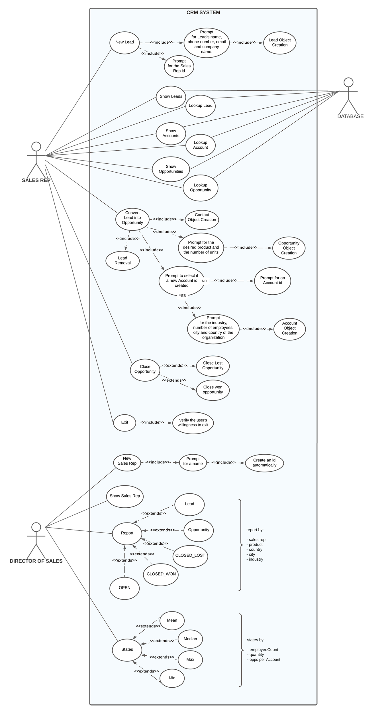
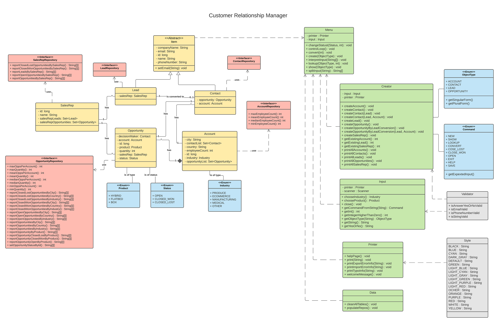

# THE CLEAN CODERS CRM

 
<b> Welcome to the cleanCRM </b>, the best tool to track current and potential customers in your sales processes !

  
This CRM will help you:

· Bring together important information about potential new customers.

· Convert leads into sales opportunities once they show interest in purchasing your product.

· Store all your contacts information.

· Associate contacts with an opportunity.

· Associate an opportunity with an account.

· Have access to various useful strategical reports, to better define a course of action for your business.

· All data will be securely stored in a Database, for later access.

  
## · Getting started

### Run the cleanCRM through an IDE
 
1. Download ZIP file of the project:

https://github.com/EN-IH-WDPT-JUN21/TheCleanCoders-CRMv2-Homework-3

[comment]: <> ( ![zipdownload.png]&#40;https://github.com/EN-IH-WDPT-JUN21/TheCleanCoders-MugglesAgainstMagic-Homework-1/blob/main/img/zipdownload.png&#41;)

2. Extract the ZIP file and open the directory as a project on an IDE such as IntelliJ

3. Run the Main.Main.java file

4. Enjoy

  
## · How the CRM works

The <b>cleanCRM</b> is a very intuitive application, however, if you are using it for the first time, you might face doubts about what the commands are. If so, please type "HELP" for further information.

### Commands available :

- NEW <Object type>                            Creates a new Object
- SHOW <Object type>                           Lists all Objects of the selected type
- LOOKUP <Object type> <Id Number>             Display the selected Object type with the indicated Id Number
- CONVERT <LEAD Id number>                     Converts the selected LEAD in CONTACT, OPPORTUNITY and ACCOUNT
- REPORT <ReportTarget> BY <ReportByObject>    Provides the requested report information
- CLOSE-WON <OPPORTUNITY Id Number>            Changes the selected OPPORTUNITY status to CLOSE-WON
- CLOSE-LOST <OPPORTUNITY Id Number>           Changes the selected OPPORTUNITY status to CLOSE-LOST 
- OPEN <OPPORTUNITY Id Number>                 Changes the selected OPPORTUNITY status to OPEN
- MEAN/MEDIAN/MAX/MIN EMPLOYEECOUNT            Displays the stats related to the number of employees of all the registered companies
- MEAN/MEDIAN/MAX/MIN QUANTITY                 Displays the stats related to the quantity of products ordered
- MEAN/MEDIAN/MAX/MIN OPPORTUNITY              Displays the stats related to the number of Opportunities associated with an Account
- POPULATE                                     Populate the database with some sample data
- HELP                                         Displays this help info
- EXIT                                         Terminates the cleanCRM program

### Object Types

Object Types Available ->                    LEAD / CONTACT / OPPORTUNITY / ACCOUNT / SALESREP

Report Targets Available ->                  LEAD /  OPPORTUNITY / CLOSED-WON / CLOSED-LOST / OPEN

Report By Objects Available ->               SALESREP /  PRODUCT / COUNTRY / CITY / INDUSTRY

** SHOW command will be followed by the Object type in plural (e.g. ``show opportunities`` )
  ** All commands are case-insensitive

  
## · Diagrams

<b>· Use case diagram : </b>

[comment]: <> (![CRM%20SYSTEM.png]&#40;https://github.com/EN-IH-WDPT-JUN21/TheCleanCoders-CRM-Homework-2/blob/main/img/CRM%20SYSTEM.png&#41;)

<b>· Class diagram : </b>

[comment]: <> (![Customer%20Relationship%20Manager.png]&#40;https://github.com/EN-IH-WDPT-JUN21/TheCleanCoders-CRM-Homework-2/blob/main/img/Customer%20Relationship%20Manager.png&#41;)

<b>· Class Relations Diagram : </b>

  
## Authors

**TheCleanCoders**: Vitaliano Costa, Maravillas Fernández, Joao Lopes, Natalia Norberciak, Katarzyna Wąsik.
  
  

[comment]: <> (![CleanCodersLogo.JPG]&#40;https://github.com/EN-IH-WDPT-JUN21/TheCleanCoders-MugglesAgainstMagic-Homework-1/blob/main/img/CleanCodersLogo.JPG&#41;)
